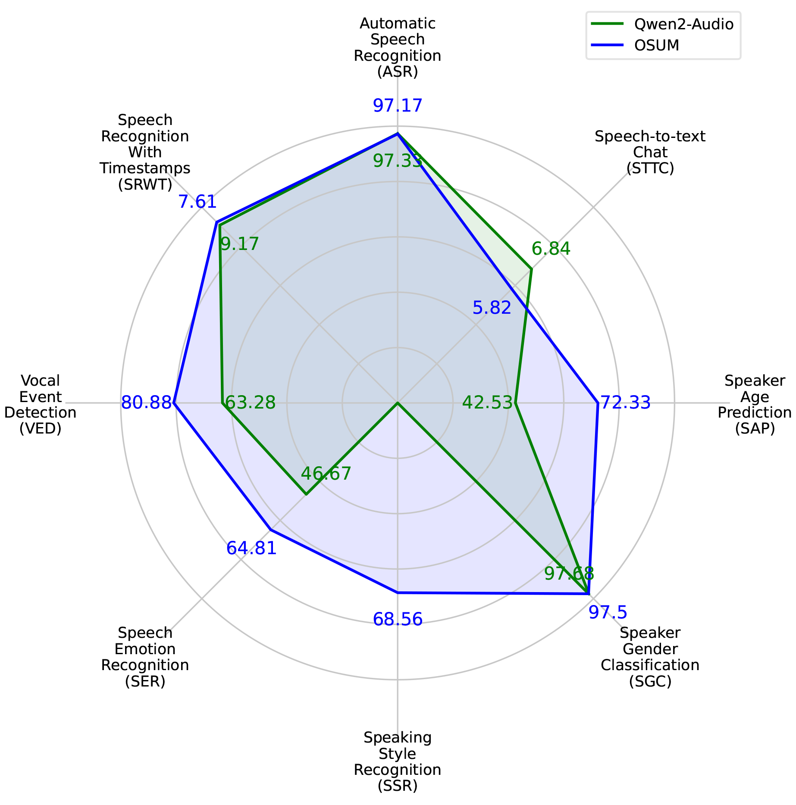
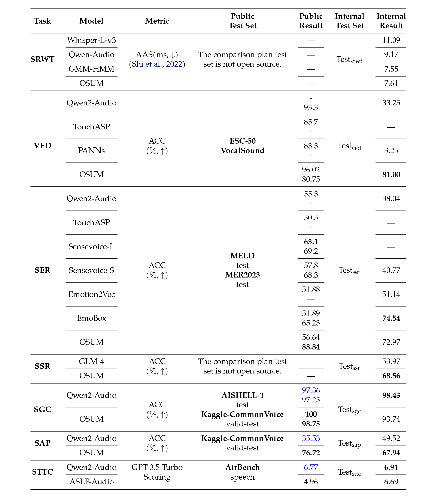

<p align="left">
        <a >中文</a> &nbsp｜ &nbsp <a href="README.md">English</a>&nbsp&nbsp
</p>
<br><br>

<p align="center">
    
<p>

<p align="center">
OSUM <a href=""> 敬请期待</a> </a>&nbsp
<br>
📑 <a href="">Paper</a> &nbsp&nbsp | &nbsp&nbsp 📑 <a href="https://aslp-lab.github.io/OSUM.github.io/">Demo</a> &nbsp&nbsp | &nbsp&nbsp 💬 <a href="">WeChat (微信)</a>&nbsp&nbsp 
</p>


我们介绍 OSUM，这是一款开源的 SULM，旨在以最低的资源需求促进更广泛的研究参与。OSUM 集成了经过多任务数据集微调的 Whisper 语音编码器，并结合了 Qwen2 大语言模型（LLM）。它支持多种语音任务，包括 <b>ASR</b>、<b>SRWT</b>、<b>VED</b>、<b>SER</b>、<b>SSR</b>、<b>SGC</b>、<b>SAP</b> 和 <b>STTC</b>。值得注意的是，<b>SSR</b> 通过确保语音风格的适当性来增强语音生成，使交互更加自然。  

为了提高训练效率和稳定性，我们采用 ASR+X 训练策略，在该策略中，辅助 ASR 任务与主要任务（X）同时训练，加速文本和音频模态的对齐。OSUM 使用了 44,100 小时的训练数据，并实现了具有竞争力的性能。该模型在 Nvidia A6000 GPU 和华为 Ascend NPU 上进行训练，并支持在两种平台上的推理。  

我们的目标是通过提供易于获取的工具和资源，促进 SULM 研究的透明化，并加速该领域的发展。

## Architecture

OSUM的架构与任务概述。

<p align="center">
    
<p>

## News and Updates
* checkpoint和测试页面即将发布，敬请期待


<br>

## Evaluation
Qwen2-Audio 和我们的 OSUM 模型比较。在大多数任务中，尽管 OSUM 使用的计算资源和训练数据明显更少，但它的表现优于 Qwen2-Audio。
<p align="center">
    
<p>

在公共和内部测试集上的 ASR 任务评估结果中，加粗字体表示同一测试集中的最佳结果。所有内部测试结果均由我们自行推理得出。


<p align="center">
    
<p>

在公共和内部测试集上的多任务评估结果中，每个测试集的最佳结果均以加粗字体突出显示。以蓝色字体显示的结果以及内部测试集上的结果，均使用我们自行推理的原始发布模型得出。
<p align="center">
    
<p>


<!--  We have provided **all** evaluation scripts to reproduce our results. Please refer to [eval_audio/EVALUATION.md](eval_audio/EVALUATION.md) for details.
  --> 


## Requirements
```
pip install requirements_little.txt
```

<!--## Quickstart
## Demo
### Web UI

## Citation
-->
## Contact Us

如果您有兴趣向我们的研究团队或产品团队留言，欢迎发送电子邮件至 g3349495429@163.com。
