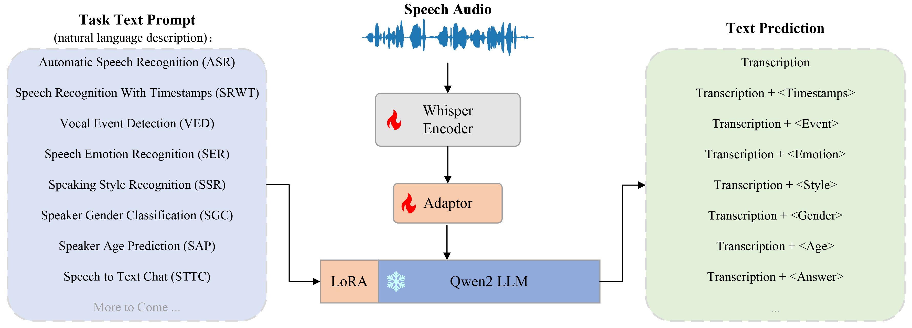
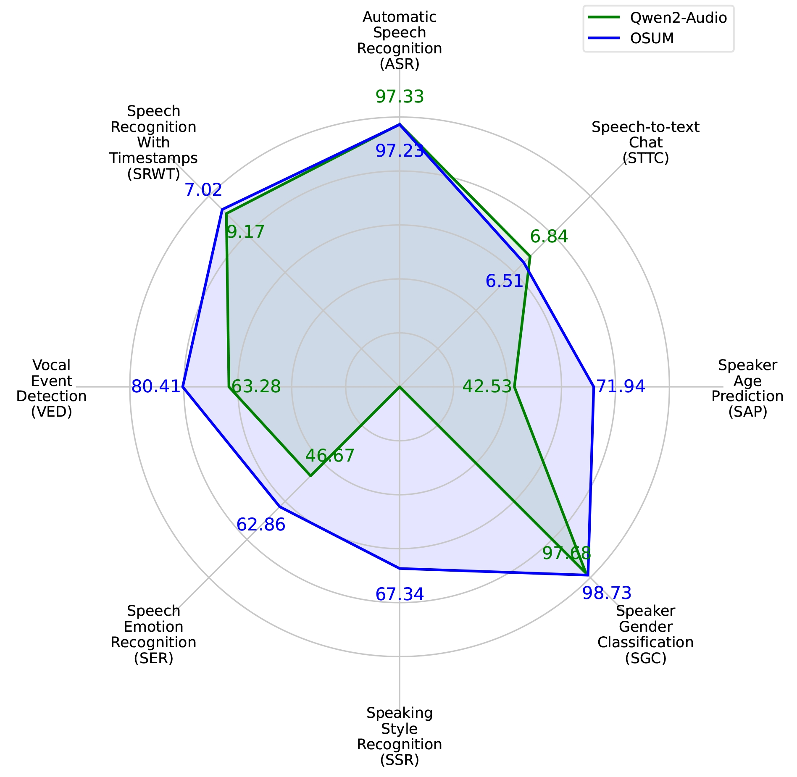
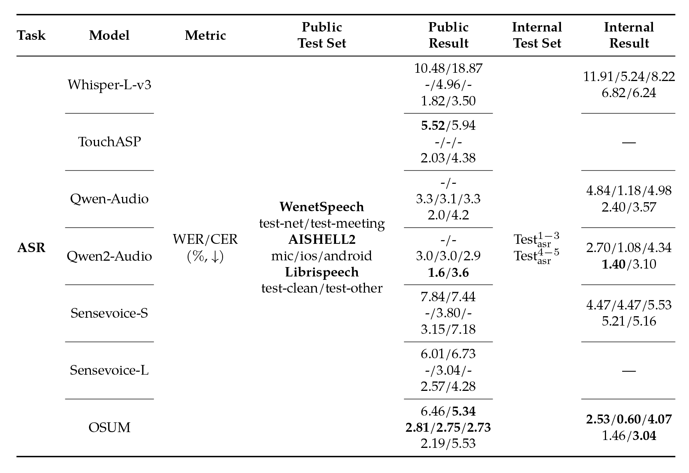
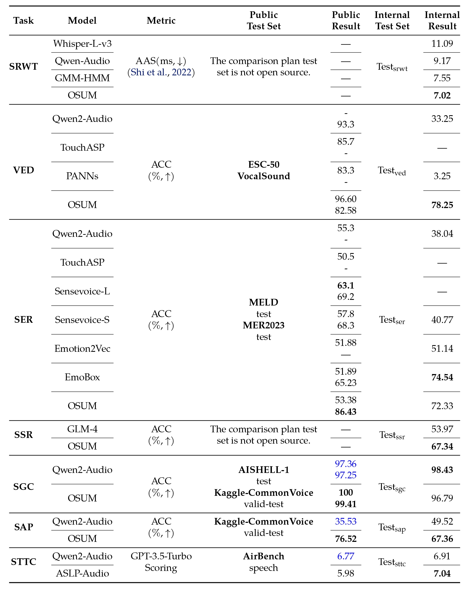

 <p align="left">
        &nbsp日本語&nbsp&nbsp ｜ <a href="README.md">English</a> &nbsp
</p>
<p align="center">
   <h1>OSUM: 限られた学術資源でのオープンな音声理解モデルの進展</h1>
</p>

耿雪龍, 魏坤, 邵琪杰, 刘水云*, 林振楠*, 赵致闲*, 李国健*, 田文杰*, 陈培坤, 李泱泽, 郭鹏程, 邵明辰, 王水源, 曹雨昂, 王成有, 徐天翼, 戴宇航, 朱新发, 李越, 张丽, 谢磊†


<p align="center">
    
<p>

<p align="center">
 <a href="https://huggingface.co/spaces/ASLP-lab/OSUM"> Huggingface Test Page</a> </a>&nbsp
<br>
📑 <a href="https://arxiv.org/abs/2501.13306v2">Paper (v2.0)</a> &nbsp&nbsp | &nbsp&nbsp 📑 <a href="https://aslp-lab.github.io/OSUM.github.io/">Demo</a> &nbsp&nbsp | &nbsp&nbsp 💬 <a href="images/introduction.md">WeChat (微信)</a>&nbsp&nbsp 
</p>


大型言語モデル（LLMs）は様々な下流タスクで顕著な進展を遂げており、音声理解言語モデル（SULMs）の開発を促進し、音声に基づく感情、性別などの副言語を用いた高表現力のインタラクションを実現することを目指しています。しかし、最先端のSULMsの多くは業界の大手企業によって開発されており、大規模なデータと計算資源を消費していますが、これらは学術界では容易に入手できません。さらに、トレーニング済みのモデルと推論コードがオープンソース化されている一方で、トレーニングフレームワークとデータ処理プロセスの透明性が欠如しており、さらなる研究の障害となっています。本研究では、限られた学術資源下でSLUMsをトレーニングする可能性を探るために、OSUMというオープンな音声理解モデルを提案します。OSUMモデルはWhisperエンコーダとQwen2 LLMを組み合わせており、音声認識（ASR）、タイムスタンプ付き音声認識（SRWT）、音声イベント検出（VED）、音声感情認識（SER）、話者スタイル認識（SSR）、話者性別分類（SGC）、話者年齢予測（SAP）、音声からテキストへのチャット（STTC）など、幅広い音声タスクをサポートしています。ASR+Xトレーニング戦略を採用することで、OSUMはモーダルアライメントとターゲットタスクを同時に最適化することにより、効率的で安定したマルチタスクトレーニングを実現しています。強力なパフォーマンスを提供するだけでなく、OSUMは透明性を重視しており、公開可能なコードを提供し、データ処理プロセスを詳細に説明しています。これにより、学術界にとって有益な参考資料を提供し、先進的なSULM技術の研究と革新を加速することを目指しています。

## アーキテクチャ

OSUMモデルはWhisperエンコーダとQwen2 LLMを組み合わせており、音声認識（ASR）、タイムスタンプ付き音声認識（SRWT）、音声イベント検出（VED）、音声感情認識（SER）、話者スタイル認識（SSR）、話者性別分類（SGC）、話者年齢予測（SAP）、音声からテキストへのチャット（STTC）など、幅広い音声タスクをサポートしています。ASR+Xトレーニング戦略を採用することで、OSUMはモーダルアライメントとターゲットタスクを同時に最適化することにより、効率的で安定したマルチタスクトレーニングを実現しています。

<p align="center">
    
<p>

## ニュースと更新情報


### 2025.2.16 🎉技術報告書 [OSUM technical report v2.0](https://arxiv.org/abs/2501.13306v2) を更新し、[checkpoint](https://huggingface.co/ASLP-lab/OSUM) をリリースし、Hugging Face 上のオンライン [test page](https://huggingface.co/spaces/ASLP-lab/OSUM) を公開しました。
技術報告書 v2.0 では、OSUM モデルはより多くのトレーニングステップを経ており、トレーニングデータ量は 50.5K 時間に増加しました（v1.0 の 44.1K 時間と比較して）：
- 3000 時間の音声性別分類（SGC）データ、既存の 1500 時間のデータにノイズを追加し、さらに 1500 時間の新しいデータを追加。
- 話者年齢予測（SAP）データの拡張：元の 3400 時間の年齢予測データにノイズを追加し、データ量を 6800 時間に倍増。
### 2025.1.22 🔥 [OSUM technical report v1.0](https://arxiv.org/abs/2501.13306v1) をリリースしました。


<br>

## 評価
OSUM モデルとQwen2-Audio の比較。OSUM は、使用する計算資源とトレーニングデータが大幅に少ないにもかかわらず、ほとんどのタスクでQwen2-Audio よりも優れたパフォーマンスを達成しています。
<p align="center">
    
<p>

公共および内部テストセットでの音声認識（ASR）タスクの評価結果は以下の表に示されています。同じテストセット内で最良の結果は太字で示されています。すべての内部結果は私たち自身で推論したものです。
<p align="center">
    
<p>

公共および内部テストセットでのマルチタスクの評価結果は以下の表に示されています。各テストセットの最良の結果は太字で強調表示されています。青字で示された結果および内部テストセットでの結果は、公式にリリースされたモデルを使用して私たち自身で推論したものです。
<p align="center">
    
<p>


<!--  We have provided **all** evaluation scripts to reproduce our results. Please refer to [eval_audio/EVALUATION.md](eval_audio/EVALUATION.md) for details.
  --> 


## 必要条件
```
pip install requirements.txt
```
<p align="left">
       OSUMフレームワークを使用して推論とトレーニングを行う方法については、 <a href="exmpales/osum/README.md">こちら</a> を参照してください。
</p>

<!--## Quickstart
## Demo
### Web UI
-->

## ライセンス契約

私たちは Apache 2.0 ライセンスを使用しています。研究者や開発者は、私たちの OSUM のコードとモデルの重みを自由に使用でき、商業利用も可能です。詳細については、ライセンスファイル [LICENSE.txt](LICENSE.txt) をご覧ください。
<br>
## 引用
```
@article{geng2025osum,
  title={{OSUM}: {Advancing} Open Speech Understanding Models with Limited Resources in Academia},
  author={Geng, Xuelong and Wei, Kun and Shao, Qijie and Liu, Shuiyun and Lin, Zhennan and Zhao, Zhixian and Li, Guojian and Tian, Wenjie and Chen, Peikun and Li, Yangze and others},
  journal={arXiv preprint arXiv:2501.13306},
  year={2025}
}
```
## お問い合わせ

私たちの研究チームまたは製品チームにメッセージを残したい場合は、`xlgeng@mail.nwpu.edu.cn` までメールを送信してください。
<p align="center">
    <a href="http://www.nwpu-aslp.org/">
        
    </a>
</p>
<p align="center">
    <a href="https://wenet.org.cn/">
        
    </a>
</p>
